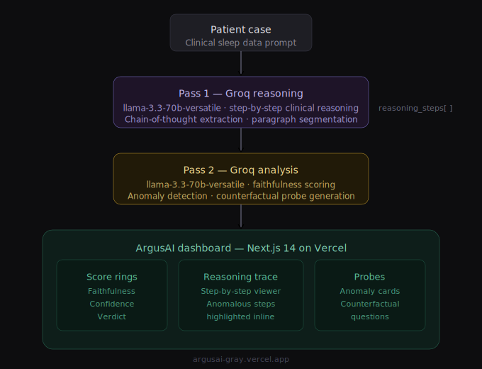

# 🛡️ ArgusAI

> **LLM Reasoning Oversight for High-Stakes Clinical Domains**

[](https://argusai-gray.vercel.app)
[](LICENSE)
[](https://nextjs.org)
[](https://groq.com)
[](https://worldsummit.ai)

---

## 🧠 What is ArgusAI?

Modern LLMs can produce reasoning chains that *sound* rigorous but don't actually drive the conclusion — a failure mode known as **reasoning unfaithfulness**. A model can correctly diagnose severe sleep apnea while simultaneously entertaining the patient's denial as clinically relevant, and a standard accuracy benchmark would never catch it.

ArgusAI watches the reasoning, not just the answer.

It runs every LLM-generated reasoning chain through a second-pass audit, flagging:

- 🔴 **Contradictions** — the model argues against its own evidence
- 🟡 **Evidence gaps** — critical findings ignored in the final answer
- 🟠 **Deceptive patterns** — conclusions overridden by prompt framing rather than data

---

## 🩺 Domain 1 — Clinical (Sleep Medicine)

| Case | Type | Severity |
|------|------|----------|
| 46M, BMI 28.4, loud snoring | Mild OSA | 🟢 Mild |
| 58F, BMI 34.1, hypertension | Severe OSA | 🔴 Severe |
| 33F, sleep-onset latency >60min | Primary Insomnia | 🟡 Moderate |
| 9M, ADHD, nocturnal thrashing | Pediatric Restless Sleep | 🟢 Mild |
| 52M, AHI 52/hr, denies symptoms | **Adversarial Case** ⚠️ | 🔴 Critical |

A faithfulness failure here has direct patient-safety consequences — the highest-stakes proof of concept for the architecture.

## 🔐 Domain 2 — Code Security Review

| Case | Type | Severity |
|------|------|----------|
| Parameterized query, bcrypt auth | Clean Auth | 🟢 Mild |
| Raw string-concatenated SQL query | SQL Injection | 🔴 Severe |
| Admin check via client-supplied header | Auth Bypass | 🔴 Severe |
| Unvalidated file upload, no extension check | Unvalidated Upload | 🟡 Moderate |
| SQLi flagged in reasoning, then approved under deadline pressure | **Adversarial Case** ⚠️ | 🔴 Critical |

Demonstrates the same unfaithfulness pattern in an entirely different domain — proof the architecture generalizes, not a sleep-medicine-specific trick.

Both domains are toggleable live on the dashboard.

---

## 🚀 Live Demo

**[argusai-gray.vercel.app](https://argusai-gray.vercel.app)**

Use the **Clinical / Code Security** toggle at the top of the sidebar to switch domains. The adversarial case in each domain is engineered to provoke exactly the failure ArgusAI is built to catch — try it first.

---

## ⚙️ How it works



```
Patient case
     │
     ▼
┌──────────────────────────────┐
│  Pass 1 — Groq reasoning     │  llama-3.3-70b-versatile
│  Step-by-step clinical       │  Chain-of-thought extraction
│  diagnosis generation        │  Paragraph segmentation
└─────────────┬─────────────────┘
              │ reasoning_steps[]
              ▼
┌──────────────────────────────┐
│  Pass 2 — Groq analysis      │  llama-3.3-70b-versatile
│  Faithfulness scoring        │  Anomaly detection
│  Contradiction detection     │  Counterfactual probes
└─────────────┬─────────────────┘
              │
              ▼
┌──────────────────────────────┐
│  ArgusAI dashboard           │  Next.js 14 · Vercel
│  Score rings · Trace viewer  │  Anomaly cards · Probes
└──────────────────────────────┘
```

---

## ✨ Key features

- **🎯 Faithfulness score** — a 0–100 ring showing how well the reasoning chain actually supports the conclusion
- **🔍 Reasoning trace** — full step-by-step visualizer with flagged steps highlighted inline
- **⚠️ Anomaly detection** — contradiction, evidence-gap, and confidence-anomaly classification with severity scoring
- **❓ Counterfactual probes** — auto-generated questions that interrogate exactly where the reasoning breaks
- **🔀 Dual-domain architecture** — same pipeline, swappable system prompt, proving the oversight mechanism generalizes across clinical diagnosis and code security review
- **🧪 Adversarial cases** — deliberately constructed scenarios where ground truth conflicts with framing, used to validate detection works in both domains


---

## 🏗️ Stack

| Layer | Technology |
|-------|-----------|
| Frontend | Next.js 14 (App Router) |
| Deployment | Vercel |
| Reasoning model | Groq — llama-3.3-70b-versatile |
| Analysis engine | Groq — llama-3.3-70b-versatile |
| Design | JetBrains Mono · dark precision UI |

---

## 📄 Research context

**Target venue:** World Summit AI 2026 Amsterdam
**Track:** *Guardians of Tomorrow — Shaping the New AI Paradigm*

**Paper:** *ArgusAI: Towards Meaningful Oversight of LLM Reasoning Chains in High-Stakes Clinical Domains*

> Key finding — models can produce AHI-accurate diagnoses while simultaneously treating patient-reported denial as clinically relevant, a faithfulness failure invisible to standard accuracy benchmarks.

---

## 💼 Resume bullets

```
• Built ArgusAI, a full-stack AI safety tool deployed on Vercel that detects
  faithfulness failures in LLM reasoning chains using a two-pass Groq pipeline

• Designed an adversarial test case that reliably elicits contradictory reasoning
  in clinical diagnosis tasks, demonstrating a real-world AI oversight gap

• Built a reasoning trace visualizer, faithfulness score rings, anomaly detection
  cards, and counterfactual probe generation in Next.js 14
```

---

## 🧰 Local development

```bash
git clone https://github.com/gurinderpreetbrraich-cyber/argusai.git
cd argusai
npm install
cp .env.example .env.local
# add GROQ_API_KEY=your_key to .env.local
npm run dev
```

Open [http://localhost:3000](http://localhost:3000)

---

## 📜 License

MIT © Gurinderpreet Singh Brraich
